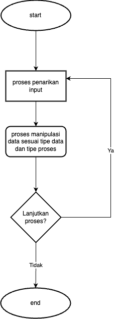

# Post test

## Soal
Buatlah program sesuai flow chart berikut

Input:
1. Data:
    - Kelas
    - Murid
2. Proses:
    - Menambah (kelas/murid)
    - Mengurangi (kelas/murid)
    - Menampilkan Daftar (daftar kelas/ daftar murid)
    - Menampilkan Nilai (Rata-rata kelas / per murid)
    - Memberikan Nilai >> pada murid

Proses Manipulasi:
1. Menambah (kelas/murid)
2. Mengurangi (kelas/murid)
3. Menampilkan Daftar (daftar kelas/ daftar murid)
4. Menampilkan Nilai (Rata-rata kelas / per murid)
5. Memberikan Nilai >> pada murid

## Catatan
- Silahkan gunakan seluruh materi yang baru kalian pelajari.
- Detail diluar dari keterangan diatas bisa ditanyakan selama kelas, atau bisa di intepretasikan sendiri.

