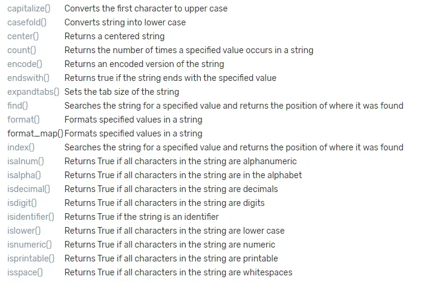

## Backend Programming Python

## Sorting & Set

## Sorting

Sorting (pengurutan) adalah proses mengatur elemen-elemen dalam suatu objek berdasarkan kunci tertentu, seperti nilai numerik atau alfabetik.

## Contoh Sorting
```python
# Metode sort()
# Sorting List
my_list = [5, 7, 2, 3, 6, 1, 5]

my_list.sort()

print(my_list) # Output [1, 2, 3, 5, 5, 6, 7]

# Reverse Sorting List
my_list = [4, 2, 1, 5, 6, 3]

my_list.sort(reverse=True)

print(my_list) # Output [6, 5, 4, 3, 2, 1]

# Metode sorted
# Sorting List 
my_list = [3, 5, 4, 1, 2]

sorted_list = sorted(my_list)

print(sorted_list) # Output [1, 2, 3, 4, 5]

# Reverse Sorting List
my_list = [3, 5, 4, 1, 2]

sorted_list = sorted(my_list, reverse=True)

print(sorted_list) # Output [5, 4, 3, 2, 1]

# Metode sort dengan key
# Sorting List String berdasarkan panjangnya
my_list = ["apple", "pie", "cherry", "elderberry", "pineapple"]

sorted_list = sorted(my_list, key=len)

print(sorted_list) # Output: ['pie', 'apple', 'cherry', 'pineapple', 'elderberry']
```

## Set

Set adalah koleksi elemen yang bersifat unik dan tidak berurutan. Berbeda dengan dengan tipe data lain seperti list atau tuple, set tidak mengizinkan adanya duplikasi elemen. Artinya, setiap elemen di dalam Python set pasti bersifat unik.

Python set dan dictionary memang menggunakan notasi yang sama, yaitu kurung kurawal '{}', tetapi ada perbedaan mendasar di antara keduanya.
Set dalam Python merupakan kumpulan elemen unik dan tidak berurutan. Dengan kata lain, set tidak memiliki pasangan "key":"value" seperti pada dictionary.

## Contoh Set
```python
# Deklarasi Set
my_set = {3, 2, 1, 3}

print(my_set) # Output {1, 2, 3}

# Menambahkan elemen ke dalam Set
my_set = {1, 2, 3}

my_set.add(4)

print(my_set) # Output {1, 2, 3, 4}

# Menghapus elemen dari Set
my_set = {1, 2, 3, 4}

my_set.remove(2)

print(my_set) # Output {1, 3, 4}
```

## Object & Classes

Python adalah bahasa pemrograman yang berorientasi objek, dimana setiap objek memiliki attribut dan behavior. Misalnya manusia sebagai objek memiliki attribut warna kulit, mata, rambut, umur, dll. Dan memiliki behavior seperti manusia butuh makan dan minum, dll.

## Clases

Class adalah prototipe untuk wadah menghimpun data yang berguna untuk menghasilkan objek.

# Contoh Classes
```python
class Product():
    total_product = 0
    
    def __init__(self, name, price):
        self.name = name
        self.price = price
        Product.total_product += 1
        
    def all_product():
        print('Total Produk : ', Product.total_product)
        
    def detail_product(self):
        print("Nama : ", self.name)
        print("Harga: ", self.price)
```

## Contoh Instance Object
```python
# membuat objek pertama
product_1 = Product('ayam geprek', 15000)

# membuat objek kedua
product_2 = Product('sei sapi', 30000)
```

## Contoh Mengakses Attributes Object
```python
# mengakses attribut objek
product_1.detail_product() 
# Output 
# Nama :  ayam geprek 
# Harga:  15000
product_2.detail_product()
# Output
# Nama :  sei sapi 
# Harga:  30000

Product.all_product()
# Output
# Total Produk :  2
```

## Method & Attribute

## Method

Method adalah fungsi yang dimiliki oleh suatu object. Contohnya kita membuat variabel bertipe string, bertipe list, bertipe numeric, dll, semua variabel tersebut adalah object, dan setiap object memiki fungsi yang hanya bisa digunakan oleh object tersebut. Sebagai contoh, object string memiliki method uppercase, dimana method upper ini tidak bisa digunakan oleh object lain seperti list atau integer. Tapi list juga memiliki fungsi seperti index, yang dimana fungsi index ini tidak bisa digunakan oleh data dengan tipe objek lain seperti string.

## Contoh Pengunaan Method
```python
# Membuat object string
my_string = 'bangunindo teknusa jaya'

# Memanggil salah satu method string
print(my_string.upper()) # Output 'BANGUNINDO TEKNUSA JAYA'

# Membuat object list
my_list = ['ayam', 'sapi', 'bebek']

# Memanggil salah satu method list
print(my_list.index('ayam')) # Output 0
```

## Contoh method yang dimiliki tipe data string


## Attribute

Attribute adalah komponen atau variabel yang dimiliki suatu kelas atau object yang dapat diwarisi.

## Contoh Pembuatan Attribute
```python
class Student:
    school = "BTJ Academy" # Class Attribute -> School
    
    def __init__(self, name, course):
        self.name = name # Instance Attribute -> Name
        self.course = course # Instance Attribute -> Course
    
student_1 = Student("Ryan", "Backend Programming")
student_2 = Student("Joko", "Frontend Programming")

print(student_1.name) # Output Ryan
print(student_2.course) # Output Frontend Programming
print(student_1.school) # Output BTJ
```

## Module & Package

## Module

Module adalah file yang berisikan kumpulan kode Python. Kode yang ada di dalamnya dapat berupa fungsi, variable, atau class.
Kumpulan kode yang berisikan fungsi, variable atau class tersebut dapat disimpan di dalam module yang kemudian dapat digunakan kembali dengan cara mengimpor atau memanggil module tersebut.

## Contoh Mengimpor Python Module Bawaan
```python
# Mengimport seluruh module datetime
import datetime

now = datetime.datetime.now()
print(now) # Output datetime.datetime(2023, 11, 24, 13, 38, 10, 795486)

# Mengimport sebagian dari module datetime
from datetime import datetime

now = datetime.now()
print(now) # Output datetime.datetime(2023, 11, 24, 13, 38, 10, 795486)

# Memberi alias pada module
import datetime as dt

now = dt.datetime.now()
print(now) # Output datetime.datetime(2023, 11, 24, 13, 38, 10, 795486)
```

## Contoh Membuat Module Sendiri
Buat file python baru, misal dengan nama hello_people.py, lalu tulis fungsi didalam file tersebut sesuai yang kamu inginkan.
```python
def greetings(name):
    return f"Hello, {name} !!"
```
Di file python lain, kamu bisa memanggil module tersebut.
```python
import hello_people

my_word = hello_people.greetings("Anton")
print(my_word) # Output 'Halo, Anton !!'
```

## Package

Package adalah sebuah cara untuk mengelola dan mengorganisir modul-modul python dalam bentuk direktori, yang memungkinan sebuah module untuk diakses menggunakan "namespace" dan "dot" lokasi.
Untuk dapat menjadikan sebuah direktori sebagai package, di dalam direktori tersebut harus memiliki satu file bernama `__init__.py` yang memberitahukan kepada interpreter bahwa direktori tersebut adalah package yang berisikan module-module.

## Contoh Directory Package
```
src/
├── luas/
│   ├── __init__.py
│   ├── lingkaran.py
│   ├── persegi.py
│   └── segitiga.py
├── volume/
│   ├── __init__.py
│   ├── bola.py
│   ├── kubik.py
│   └── silinder.py
└── main.py
```
File `__init__.py` cukup berupa file kosong, yang tidak perlu diisi apa pun.

Untuk masing-masing file, silakan dibuatkan fungsi yang sesuai dengan module yang ingin dibuat.
Contoh pada file lingkaran.py dapat ditambahkan fungsi untuk menghitung luas lingkaran.
```python
# Contoh Fungsi Menghitung Luas lingkaran
def luas_lingkaran(r):
    return round(3.14 * r * r)
```

## Contoh mengimpor package
```python
from luas.lingkaran import luas_lingkaran

r = 7
luas = luas_lingkaran(r)
print(luas) # Output 153.86
```

## Args, Kwargs, dan Decorator

## Args & Kwargs
Args adalah sintaks untuk memasukan argument dengan mewakilkan secara berurut tanpa memasukan keywarod, umumnya berbentuk list, tuple.

Kwargs adalah sintaks untuk memasukan argument yang mewakilkan dengan memasukan keywarod, berbentuk dictionary.

Contoh
```python
# muncul pada inisiasi
def halo_nama(*args,**kwargs):
    print([i for i in args])
    print({k:v for k,v in kwargs.items()})
    
halo_nama('a',1,5,'bc',a=2,b='abc')

# Output
# ['a', 1, 5, 'bc']
# {'a': 2, 'b': 'abc'}

# muncul pada penggunaan
def halo(nama, umur):
    print(nama)
    print('dengan umur:', umur)
    
ar = ['Asep', 5]
kw = {
    'umur': 5,
    'nama': 'Asep'
}

halo(*ar)
halo(**kw)
# Output
# Asep
# dengan umur: 5
```

## Decorator
Decorator adalah fungsi yang melakukan operasi terhadap fungsi lain dan memodifikasi perilakunya tanpa harus mengubah secara eksplisit.
Decorator merupakan fungsi yang menerima fungsi lain sebagai argumennya (first-class object). 

## Contoh Decorator sederhana pada fungsi tanpa paramater
```python
# Contoh decorator
def simple_decorator(func_name):
    def hello():
        print("Hello")
        func_name()
        print("How are you?")

    return hello

# Contoh bentuk tanpa decorator
def person():
    print('Jeni')
person = simple_decorator(person)
person()

# Contoh penggunaan decorator
@simple_decorator
def person():
    print('Jeni')

person()

# Output 
# Hello
# Jeni
# How are you?
```

## Contoh decorator dengan fungsi yang memiliki paramater atau argumen

Agar decorator dapat mendekorasi fungsi dengan paramater atau argumen, diperluikan tambahan argumen *args dan **kwargs dalam fungsi yang digunakan pada decorator
```python
# Contoh decorator
def simple_decorator(func_name):
    def hello(*args, **kwargs):
        print("Hello")
        func_name(*args, **kwargs)
        print("How are you?")

    return hello

# Contoh bentuk tanpa decorator
def person(name):
    print(name)
person = simple_decorator(person)
person()

# Contoh penggunaan decorator
@simple_decorator
def person(name):
    print(name)

person('Jeni')
# Output 
# Hello
# Jeni
# How are you?
```